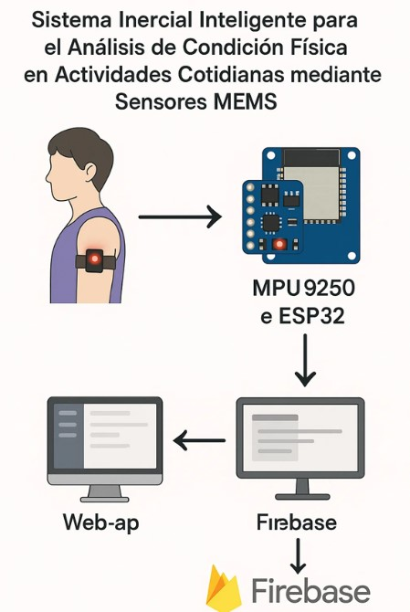
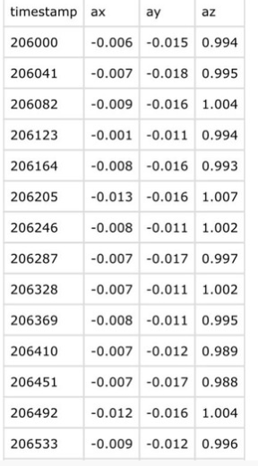
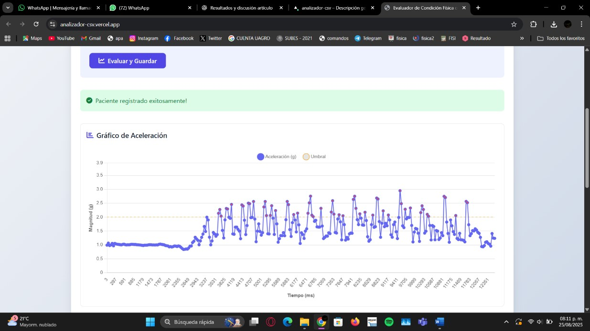
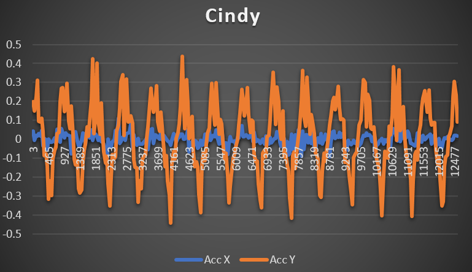

# Sistema Inercial Inteligente para el Análisis de Condición Física

<div align="center">


### Sistema portátil para monitorear actividad física mediante sensores MEMS

</div>

---

## 📖 Descripción

Este proyecto implementa un sistema inteligente capaz de capturar y analizar movimientos corporales utilizando un sensor inercial **MPU9250** conectado a un **ESP32**.

La información recolectada se transmite de forma inalámbrica hacia una aplicación web donde es procesada para determinar la condición física del usuario.

El sistema puede diferenciar actividades como:

✅ Caminar

✅ Trotar

✅ Correr

Y generar una clasificación básica de la condición física.

---

## Vista General

<p align="center">

</p>

---

## ⚙️ ¿Cómo funciona?

### 1️⃣ Captura de Movimiento

El sensor MPU9250 registra:

* Aceleración en los ejes X, Y y Z
* Velocidad angular
* Orientación espacial

<p align="center">

</p>

---

### 2️⃣ Procesamiento en ESP32

El ESP32:

* Lee los datos del MPU9250
* Filtra ruido
* Procesa señales
* Envía la información inalámbricamente

<p align="center">

</p>

---

### 3️⃣ Almacenamiento de Datos

Los datos son almacenados en formato CSV para su posterior análisis.

Ejemplo:

| Tiempo | AccX | AccY  | AccZ |
| ------ | ---- | ----- | ---- |
| 0.01   | 0.25 | -0.31 | 9.81 |
| 0.02   | 0.28 | -0.27 | 9.79 |

---

### 4️⃣ Análisis Inteligente

La aplicación analiza:

* Frecuencia de movimiento
* Intensidad
* Regularidad
* Estabilidad

para determinar el desempeño físico.

---

### 5️⃣ Resultados

El sistema clasifica automáticamente:

🟢 Buena condición física

🔴 Condición física deficiente

<p align="center">

</p>

---

##  Arquitectura del Sistema

```text
MPU9250
   │
   ▼
ESP32
   │
   ▼
Captura de datos
   │
   ▼
Archivo CSV
   │
   ▼
Página Web
   │
   ▼
Procesamiento
   │
   ▼
Clasificación Física
```

## 🔧 Hardware Utilizado

| Componente   | Descripción                |
| ------------ | -------------------------- |
| ESP32        | Microcontrolador principal |
| MPU9250      | Sensor inercial de 9 ejes  |
| Batería LiPo | Alimentación portátil      |
| Switch       | Encendido del sistema      |
| Gabinete     | Protección del hardware    |

---

## 💻 Software Utilizado

* Arduino IDE
* HTML5
* CSS3
* JavaScript
* Firebase

---

## 📊 Actividades Detectadas

| Actividad | Características              |
| --------- | ---------------------------- |
| Caminata  | Picos suaves y constantes    |
| Trote     | Mayor frecuencia             |
| Carrera   | Alta amplitud y variabilidad |

---

## 📸 Evidencias

### Dispositivo Final

<p align="center">

</p>

### Página Web

<p align="center">

</p>

### Gráficas de Movimiento

<p align="center">

</p>

---

## 🚀 Características

* Captura de movimiento en tiempo real
* Comunicación inalámbrica
* Procesamiento automático
* Clasificación física inteligente
* Bajo costo
* Fácil implementación

---

## 🎯 Aplicaciones

* Monitoreo de actividad física
* Rehabilitación
* Prevención de caídas
* Seguimiento deportivo
* Investigación biomédica
* Salud preventiva

---


Universidad Autónoma de Guerrero

---

⭐ Si este proyecto te resulta interesante, considera darle una estrella al repositorio.
